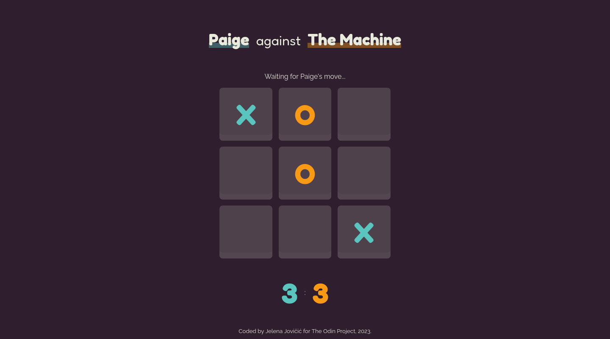

WIP

# The Odin Project - Tic Tac Toe

A classic Tic Tac Toe game you can play in your browser. Built using JavaScript, HTML, and Sass for [The Odin Project](https://www.theodinproject.com).

## Table of contents

- [Overview](#overview)
  - [Description](#description)
  - [Screenshot](#screenshot)
  - [Links](#links)
- [My process](#my-process)
  - [Built with](#built-with)
  - [The process](#the-process)
  - [Continued development](#continued-development)
  - [Useful resources](#useful-resources)
- [Author](#author)

## Overview

### Description

A tic tac toe game made as a part of [The Odin Project](https://www.theodinproject.com) curriculum.

### Screenshot

  

### Links

- [Solution](https://github.com/je-jo/tic-tac-toe)
- [Live Site](https://je-jo.github.io/tic-tac-toe/)

## My process

### Built with

- Semantic HTML5 markup
- Sass (7-in-1 architecture)
- CSS Grid
- Mobile-first workflow
- JavaScript

### The process

The project's purpose is to get familiar with the concepts of modules and factory functions.

### Continued Development

- [ ] Create AI so that a player can play against the computer.

### Useful resources

- [Building A House From The Inside Out](https://www.ayweb.dev/blog/building-a-house-from-the-inside-out) - Example of code organization.
- [How To Lint and Format Code with ESLint in Visual Studio Code](https://www.digitalocean.com/community/tutorials/linting-and-formatting-with-eslint-in-vs-code) - A tutorial for setting up ESLint for a project.
- [7-1 pattern boilerplate](https://github.com/KittyGiraudel/sass-boilerplate/tree/master/stylesheets) - A boilerplate for 7-1 Sass Architecture.
- [HTML / Sass Jumpstart]() - Mostly plucked some sensible values (font sizes, spacings, buttons, etc) from here and a reset file.
- [google web fonts helper](https://gwfh.mranftl.com/fonts) - A Hassle-Free Way to Self-Host Google Fonts.
- [Paraiso colors](https://github.com/je-jo/paraiso-colors)
- [Favicon Generator](https://favicon.io/favicon-generator/)

## Author

- [Github](https://github.com/je-jo)
- [LinkedIn](https://www.linkedin.com/in/jelena-jovicic/)
- [Frontend Mentor](https://www.frontendmentor.io/profile/je-jo)
- [Codepen](https://codepen.io/je-jo)
- [Twitter](https://twitter.com/jelena_jo_)
